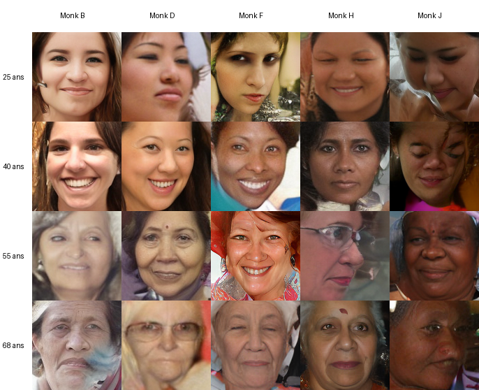

# FaceDiT — génération de visages à attributs vérifiables

Projet MSC AIC — **ACHALI Ikram · BENLOUALI Ouiam**

Un *Diffusion Transformer* latent, écrit en PyTorch et entraîné depuis zéro, qui produit
un visage à partir de trois consignes : **âge** (20-70 ans, continu), **genre**, et
**teint de peau** mesuré par son angle ITA.

La particularité n'est pas le générateur : l'architecture DiT est publiée. C'est la
**boucle fermée**. Chaque image produite est immédiatement re-mesurée par des instruments
indépendants du générateur, et l'écart entre ce qui a été demandé et ce qui a été obtenu
s'affiche sous l'image. Un modèle peut afficher un curseur « 60 ans » et produire un
visage de 40 ans sans que rien ne le signale ; ici, si, cela se voit.



*Quatre âges (lignes) × cinq échelons de teint (colonnes), genre fixé, même modèle, même
réglage. Aucune sélection : ce sont les premières images tirées.*

---

## Tester en cinq minutes

**Aucun GPU n'est nécessaire.** Sur processeur, une image demande environ 5 secondes au
lieu de 0,8 sur GPU — c'est parfaitement utilisable pour la démonstration. Les poids
entraînés sont dans le dépôt : il n'y a rien à télécharger séparément.

```bash
git clone <url-du-depot> && cd image_GEN

python -m venv .venv
# Windows PowerShell : .venv\Scripts\Activate.ps1
# Windows cmd        : .venv\Scripts\activate.bat
# Linux / macOS      : source .venv/bin/activate

# PyTorch d'abord, depuis son propre index. Choisissez UNE ligne :
pip install torch==2.6.0 torchvision==0.21.0 --index-url https://download.pytorch.org/whl/cpu
# ou, si vous avez une carte NVIDIA :
# pip install torch==2.6.0 torchvision==0.21.0 --index-url https://download.pytorch.org/whl/cu126

pip install -r requirements.txt

python app.py
```

L'interface s'ouvre sur `http://127.0.0.1:7860`. Au démarrage, elle annonce ce qu'elle a
chargé :

```
[app] chargement du générateur : poids/facedit_v3.pt
[app] 32.96 M paramètres · pas 220000 · calcul sur cpu
[app] oracle de mesure : poids/oracle.pt
```

Python 3.12 est recommandé. Le premier lancement télécharge le décodeur VAE
(`stabilityai/sd-vae-ft-mse`, ~320 Mo) depuis Hugging Face ; c'est la seule dépendance
réseau, et elle est mise en cache.

---

## Ce qu'il y a à regarder

**Le compteur d'écart, sous l'image.** C'est le cœur du projet. Demandez 65 ans, teint H,
et lisez ce que l'image contient réellement. La ligne grise rappelle l'erreur propre de
l'instrument de mesure — 5,7 ans sur des visages réels. **Un écart plus petit que cela ne
signifie rien**, et l'interface le dit plutôt que de laisser croire à une précision qu'elle
n'a pas.

**Le nuancier de teint.** Les dix échelons de l'échelle de Monk servent de vocabulaire à
l'utilisateur. Le modèle, lui, est piloté par l'ITA, un angle calculé sur les pixels de
peau en espace CIELAB. Ce choix est délibéré : l'ITA est une grandeur physique continue et
vérifiable, là où une catégorie ethnique ne serait ni interpolable ni mesurable.

**La transition progressive** (volet repliable, en bas). Réglez un départ dans le panneau
principal, une arrivée dans le volet, et le modèle produit les étapes intermédiaires. La
graine est partagée entre toutes les vignettes : c'est la même personne qui vieillit, pas
un fondu entre deux inconnus. C'est ce qu'une liste de catégories ne permet pas — entre
« 30 ans » et « 40 ans », une classe ne contient rien.

**Réglages avancés**, si vous voulez pousser :

| Réglage | Ce qu'il fait |
|---|---|
| Force du contrôle (`w`) | Monte l'obéissance aux consignes, baisse le réalisme et la variété. 2 est l'optimum mesuré. |
| Graine | Décide *quelle personne* apparaît. La garder fixe permet de ne changer qu'un réglage et d'isoler son effet. |
| Écarter les images ratées | Le modèle rate ~8,5 % des tirages. Décochez pour voir la sortie brute, non filtrée. |

Pour vérifier que rien n'est caché : décochez le rejet automatique, et regardez les échecs.

---

## Résultats mesurés

Modèle livré, celui que `app.py` charge : **v3**, 32,96 M paramètres, 220 000 pas, ~17 h
sur RTX 4060 Laptop 8 Go.

Les deux colonnes ci-dessous sortent du **même** fichier de protocole (`eval_fast.yaml` :
5 000 images générées, 25 pas, w = 3). C'est la seule façon de les comparer : le FID monte
mécaniquement quand l'échantillon rétrécit, et confronter 5 000 images à 10 000 mesurerait
la taille de l'échantillon plutôt que le modèle.

| Mesure | v2 | **v3 (livré)** | Cible | Instrument |
|---|---|---|---|---|
| FID | 22,01 | **20,05** | < 30 | clean-fid, mode *clean* |
| Précision du genre | 99,9 % | **99,9 %** | > 90 % | oracle ResNet-18 |
| Erreur d'âge (MAE) | 4,39 ans | **4,16 ans** | < 8 ans | oracle ResNet-18 |
| Écart de teint (ITA) | 3,21° | **2,87°** | < 10° | calcul analytique, sans réseau |
| Diversité (LPIPS intra-condition) | 0,422 | **0,414** | > 0,35 | LPIPS AlexNet |
| Désenchevêtrement | 21:1 | **50:1** | — | matrice de fuite 3×3 |
| Latence, une image | — | 0,77 s GPU · ~5 s CPU | < 3 s | — |

Le **ratio 50:1** est le chiffre dont nous sommes le plus satisfaites : faire varier l'âge
déplace l'âge cinquante fois plus que le genre ou le teint. C'est le désenchevêtrement,
mesuré plutôt qu'illustré par une planche d'images choisies.

Une évaluation en protocole complet (10 000 images, 50 pas) n'existe que pour v2 : FID
17,60, genre 100 %, âge 4,26 ans, ITA 3,21°. Elle **ne se compare pas** aux colonnes
ci-dessus, et v3 n'a jamais été passé dans ce protocole faute de temps machine.

Tous les chiffres viennent de `results/*/results_*.json`, régénérables par le harnais
d'évaluation. Aucun n'est saisi à la main.

### Trois réserves, énoncées plutôt que tues

**L'instrument d'âge est saturé.** L'erreur de 4,16 ans est *inférieure* à l'erreur de
notre propre oracle sur des visages réels (5,74 ans). Ce chiffre ne prouve pas que le
modèle fait mieux : seulement qu'on ne sait plus le mesurer. Descendre plus bas demanderait
un meilleur oracle, pas un meilleur générateur.

**Le test de mémorisation de v3 n'est pas vierge.** 4 images sur 250 tombent sous le
1ᵉʳ centile de la distribution réelle et demandent une inspection visuelle. Le même test
sur v2 ne signalait rien sur 500 images — mais les deux verdicts ne sont pas comparables :
le seuil est recalibré à chaque exécution, et il valait 0,035 pour v2 contre 0,124 pour v3,
soit un critère 3,6 fois plus large. Ce n'est donc pas une régression constatée, c'est une
calibration instable. Le test doit être refait à seuil fixe avant qu'on puisse en conclure
quoi que ce soit.

**Les baselines n'ont pas été exécutées.** StyleGAN2 et le modèle texte-image sont
implémentés et branchés sur le même harnais, mais les poids externes n'étaient pas
disponibles sur une machine hors ligne. La comparaison à l'état de l'art manque au dossier.

---

## Où est le code

```
app.py                  interface Gradio — la boucle génération → mesure
facedit/
  models/dit.py         LE MODÈLE, écrit à la main : attention, adaLN-Zero, patchify
  models/embeddings.py  traits de Fourier (âge, ITA) + table apprise (genre)
  sample.py             échantillonnage DDIM, guidage CFG, interpolation
  train.py              boucle d'entraînement, EMA, reprise après coupure
  data/ita.py           calcul de l'ITA et masque de peau — l'instrument de teint
  data/filter_faces.py  filtre qualité : un seul visage, net, de face
  data/align.py         alignement par similitude sur les yeux
  oracle/               ResNet-18 à trois têtes — l'instrument d'âge et de genre
  eval/                 FID, fuite d'attributs, sous-groupes, mémorisation
  quality.py            rejet des générations ratées
baselines/              StyleGAN2 et texte-image (implémentés, non exécutés)
configs/                un fichier par palier, chacun justifiant ses écarts au précédent
poids/                  poids du générateur et de l'oracle, prêts à l'emploi
docs/CONCEPTION.md      le détail technique : décisions, mesures, pièges rencontrés
```

`facedit/models/dit.py` est écrit sans importer aucune classe de modèle : seuls
`nn.Linear`, `nn.LayerNorm`, `nn.Embedding` et `F.scaled_dot_product_attention`. Le
planning de bruit, lui, vient de `diffusers` — réécrire une formule fermée déjà éprouvée
n'aurait ajouté qu'un risque d'erreur silencieuse.

Les fichiers de `configs/` se lisent comme un journal de bord : chacun explique, chiffres
à l'appui, ce qu'il change par rapport au précédent et pourquoi.

---

## Tests

```bash
python -m pytest tests/ -q          # 149 tests, ~15 s, sans GPU ni jeu de données
```

Le test qui compte le plus est `test_conditions_differentes_donnent_sorties_differentes`.
Il garde contre le risque n°1 de ce type de projet : un conditionnement débranché produit
une courbe de perte parfaitement décroissante et un modèle qui ignore ses attributs. Il est
vérifié attribut par attribut — un conditionnement branché pour l'âge mais mort pour l'ITA
passerait un test global.

---

## Reproduire l'entraînement

Non nécessaire pour évaluer le projet, les poids étant fournis. Compter **≈ 24 h** sur
RTX 4060 Laptop, dont 17 h d'entraînement, plus le téléchargement de FairFace (~108 500
images).

```bash
bash scripts/run_full_pipeline.sh
```

Le script enchaîne filtrage, encodage VAE, oracle, les deux paliers d'entraînement, le
benchmark et l'export des poids. Il s'arrête à la première erreur et journalise chaque
étape dans `logs/`.

Pour réduire un checkpoint d'entraînement (528 Mo) au fichier de poids distribuable
(66 Mo) :

```bash
python scripts/export_weights.py runs/final_v3/ckpt_final.pt poids/facedit_v3.pt
```

L'export ne conserve que les poids EMA, en float16, et **vérifie** que la conversion ne
déplace pas la sortie du modèle au-delà de 1e-3 en relatif avant d'écrire le fichier.
Mesuré : 5,7e-4, soit un écart maximal d'un niveau de gris sur 255.

---

## Limites et éthique

Le genre est binaire dans FairFace, donc dans le modèle. C'est une limite héritée des
données, pas une position : elle est signalée partout où elle a un effet.

L'ITA remplace toute catégorie ethnique. Le modèle ne connaît pas de « races » ; il connaît
une pigmentation mesurée en degrés. Ce déplacement est le principal choix éthique du
projet.

L'oracle n'est pas neutre : sa précision de genre va de 91,7 % sur les visages noirs à
98,0 % sur les visages indiens et moyen-orientaux. Un audit par sous-groupes qui utiliserait
cet oracle sans le dire attribuerait au générateur des défauts de son propre instrument.
Les deux séries de chiffres sont publiées ensemble.

Toute image quittant l'interface par le bouton de téléchargement porte la mention
« IMAGE GÉNÉRÉE PAR IA » incrustée dans les pixels. Une image enregistrée par clic droit
depuis le navigateur y échappe : c'est le coût réel du choix de ne pas incruster la mention
à l'affichage, et il est énoncé plutôt que passé sous silence.

Aucun visage produit ne représente une personne réelle. Le test de mémorisation cherche,
pour chaque image générée, son plus proche voisin dans le jeu d'entraînement ; ses
résultats et leur calibration instable sont rapportés sans arrondi plus haut.

---

## Documents

- **Rapport de projet** (remis à part) — chiffres à jour, décisions, analyse critique.
  C'est le document de référence. L'**état de l'art** a fait l'objet d'un livrable
  antérieur et n'est pas repris ici.
- `docs/CONCEPTION.md` — journal de conception du **palier 1**, conservé tel quel. Ses
  chiffres sont ceux d'un modèle trois paliers en arrière ; il documente le raisonnement,
  pas le résultat. Un avertissement en tête le rappelle.
- `configs/*.yaml` — chaque fichier justifie, mesures à l'appui, ce qu'il change par
  rapport au palier précédent. C'est là que se lit la progression du projet.

---

## Licences et attributions

FairFace (CC BY 4.0) · `sd-vae-ft-mse` (CreativeML Open RAIL-M) · StyleGAN2-ADA (NVIDIA
Source Code License, poids non redistribués) · CodeFormer (S-Lab License 1.0, usage non
commercial) · MediaPipe (Apache 2.0).
